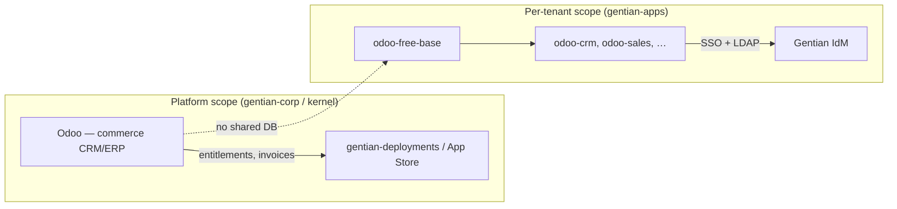
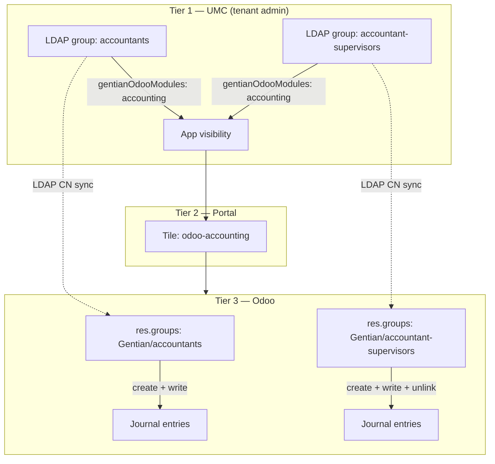
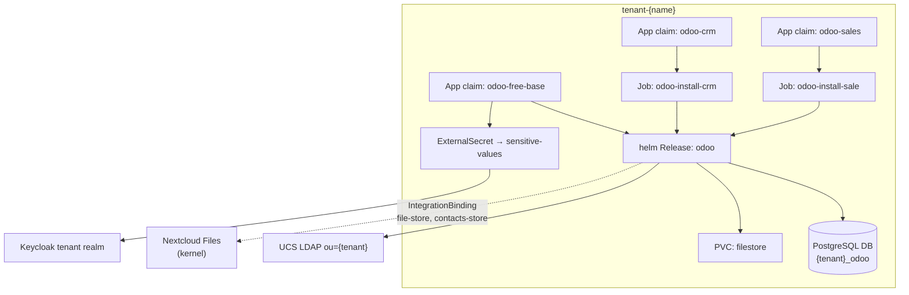

# Odoo on Gentian OS — integration plan

**Status:** Design proposal  
**Companion to:** [architecture.md](../../../gentian-os/docs/architecture.md),
[app-catalogue.md](../../../gentian-os/docs/design/app-catalogue.md),
[iam.md](../../../gentian-os/docs/design/iam.md),
[business-logic-plan.md](../../../gentian-os/docs/design/business-logic-plan.md)

This document outlines how to add **Odoo Community** as a Gentian **base app**
with individually installable Odoo modules as catalogue entries, Gentian IdM,
admin-only configuration surfaces, and contract-based integrations (e.g. files).

**Chosen approach:** **A + hybrid RBAC (model 3)** — OX-style `odoo-free-base`
+ thin module profiles, with a three-tier permission model:

1. **UMC** — tenant admins define LDAP groups and assign which Gentian/Odoo apps
   each group may see.
2. **Portal** — enforces app visibility from UMC group assignments.
3. **Odoo** — LDAP group equivalents (`res.groups`) where tenant admins configure
   what members may do *inside* an app (create / edit / delete, menus, record rules).

All Odoo-side Gentian behaviour lives in one addon family **`gentian_os`** in
`odoo-modules/` (§5) — RBAC, portal embed mode, and contract consumers share one
version line and one install path.

---

## 1. Goals and constraints

| Requirement | Design response |
|---|---|
| Gentian IdM (Keycloak + LDAP) | Per-tenant realm OIDC + kernel IdP broker; LDAP user/group sync into Odoo |
| Individual Odoo apps installable as Gentian apps | One **module AppProfile** per Odoo app (CRM, Sales, Inventory, …) |
| Configuration visible to tenant admin only | **Base profile** exposes admin-only portal tile; module profiles expose user tiles only |
| Tenant-defined groups control app + Odoo rights | Three-tier RBAC — UMC groups → portal visibility → Odoo `res.groups` (§4.3) |
| Future integrations via Gentian contracts | `gentian_os` addon consumes `IntegrationBinding` secrets; base declares `optionalIntegrations` (§5.4, §8) |
| Fits Gentian catalogue model | Profile bundles under `gentian-apps/profiles/`; `app-odoo` composition for non-default MR graph |

### Non-goals (this plan)

- Replacing **platform commerce Odoo** (customers, orders, entitlements in
  [business-logic-plan.md](../../../gentian-os/docs/design/business-logic-plan.md)) —
  that remains a **separate** kernel- or corp-scoped instance (see §2).
- Odoo Enterprise licensing / proprietary modules in `gentian-premium` (can follow
  the same pattern later with `edition: enterprise` profiles).

---

## 2. Two Odoo instances — do not conflate

Gentian already references Odoo in two distinct roles:



| Instance | Purpose | Git / deploy | Who uses it |
|---|---|---|---|
| **Platform Odoo** | Sell Gentian apps, subscriptions, invoices | `gentian-corp` or kernel extension; not an AppProfile | Gentian operators, billing |
| **Tenant Odoo** | Customer organisation ERP (CRM, accounting, …) | `gentian-apps/profiles/odoo-*` | Tenant users + tenant admin |

They must **not** share a database or Keycloak client. Contracts between them
(if ever needed) go through HTTP APIs and Gentian integration patterns — not
co-location.

---

## 3. Recommended pattern: OX-style base + module profiles

Odoo is a **single multi-module application** per database, but Gentian users
expect **one catalogue entry per installable app** (like OX mail/calendar/tasks
under one `ox-appsuite` install, or Element + Jitsi sidecar).

**Recommended layout:**

```
gentian-apps/profiles/
├── odoo-free-base/          # platform tier — deploys Odoo runtime (this folder)
│   ├── odoo-plan.md
│   ├── profile.yaml         # base AppProfile (admin-only)
│   ├── composition.yaml     # app-odoo
│   └── kustomization.yaml
├── odoo-crm/
│   ├── profile.yaml         # thin module profile
│   └── kustomization.yaml
├── odoo-sales/
├── odoo-inventory/
└── …
```

### 3.1 Roles

| Profile kind | Example | Helm release | Portal tiles | App Store |
|---|---|---|---|---|
| **Base** | `odoo-free-base` | **Yes** — one Odoo Deployment per tenant | Admin only (`Tenant Admins`) | Hidden or “Odoo Platform (required)” |
| **Module** | `odoo-crm`, `odoo-sale` | **No** — module install Job only | User tile(s) with deep link | Visible, installable |

**Analogy:** `ox-appsuite` = one backend + many `portalTiles`; here
`odoo-free-base` = one Odoo instance + many module profiles add Odoo modules
and tiles.

### 3.2 Base auto-install

When a tenant admin installs any `odoo-*` module profile, the **operator**
should **implicitly ensure** `odoo-free-base` is present in `Tenant.spec.apps`
(or materialise its `App` claim without store listing):

- Matches Element → Jitsi bundling (sidecar auto-deployed).
- Avoids “install CRM first, discover you need a base” friction.
- Base remains **absent from end-user portal**; only module tiles appear for
  `App Users`.

**Implementation sketch:** extend tenant reconciliation:

```go
// Pseudocode — operator tenant_controller
for each app in tenant.Spec.Apps {
    if profile.Spec.Family == "odoo" && profile.Name != "odoo-free-base" {
        ensureAppClaim("odoo-free-base")
    }
}
```

Alternative considered: explicit base install first — rejected for UX; the app
store can still show a dependency note in metadata.

### 3.3 New AppProfile fields (gentian-os)

Module profiles need a way to declare **no chart / module-only** behaviour.
Prefer extending the CRD over many one-off compositions:

```yaml
# odoo-crm/profile.yaml (illustrative)
spec:
  family: odoo
  edition: crm
  deploymentRole: module          # NEW: base | module (default: standalone)
  odooModule:                     # NEW: when deploymentRole=module
    technicalName: crm
    dependsOn: [base]             # optional Odoo module deps
  requiresBaseProfile: odoo-free-base
```

| Field | Purpose |
|---|---|
| `deploymentRole: base` | Full Helm release + shared ingress |
| `deploymentRole: module` | Crossplane Job `odoo-bin -i <module> --stop-after-init`; portal tile only |
| `family: odoo` | Groups profiles; shared DB name, ingress host, composition |
| `requiresBaseProfile` | Admission + operator auto-install |

Until CRD fields land, `app-odoo` can key off profile name prefix `odoo-` and
an annotation `gentianos.io/odoo-role: base|module`.

---

## 4. Identity and access

Follow the **standard Gentian AppProfile IdM pattern**
([app-profile-guide.md](../../app-profile-guide.md) §2, §8):

| Concern | Configuration |
|---|---|
| IdP host | `https://id.${KERNEL_DOMAIN}/realms/${TENANT_ID}` |
| OIDC client | `odoo` (base); module profiles **reuse** base client (no extra Keycloak clients) |
| Access type | `CONFIDENTIAL` |
| Redirect URIs | `https://erp.${TENANT_DOMAIN}/auth_oauth/signin` (exact paths depend on auth module) |
| LDAP | `sync: true` — provision users from tenant OU; map `managed-by-attribute-Odoo*` groups |
| Portal login | Kernel realm at portal → tenant realm broker (operator-managed) |

### 4.1 Admin vs user visibility (IAM)

Align with [iam.md](../../../gentian-os/docs/design/iam.md) and
[portal-admin-tile.md](../../docs/portal-admin-tile.md):

| Surface | Portal tile | Who sees it |
|---|---|---|
| Odoo **Settings / Apps / Users** | `odoo-admin` on **base** profile | `Tenant Admins` only (`cn=admins_<tenant>`) |
| Odoo **CRM, Accounting, …** | one tile per **module** profile | Users whose UMC groups grant that module (§4.3) |

Tenant admins use the **Admin User** template (no app-enabling attributes);
they see UMC/admin tiles including Odoo configuration. App users see module
tiles only — not `/web#menu_id=…` settings URLs.

Module install Jobs run with admin API credentials from OpenBao (`appSecrets`),
not end-user tokens.

### 4.2 OIDC — no gentian-os pack required for Odoo

**OpenDesk OIDC packs** (`internal/oidc/packs/opendesk.yaml`, embedded in the
operator) exist for apps that need **custom Keycloak client scopes, protocol
mappers, and LDAP-group → client-role mappings** (e.g. `opendesk_username`,
`opendesk-matrix-scope`). That is **not** the default path for new catalogue apps.

| Path | When | Gentian-os change per new app? |
|---|---|---|
| **`app-default` / `app-odoo` Client MR** | Standard OIDC client + redirect URIs; app uses LDAP or generic claims | **No** — only `AppProfile.kernelRequirements.identity.oidc` |
| **Operator OIDC pack Job** | openDesk-style custom scopes/mappers/roles | **Yes today** — pack keyed by `clientId` in embedded catalog |
| **Minimal client Job** | Legacy fallback if composition does not emit Client MR | **No** — basic client only |

**Odoo** should use the **composition Client MR** path:

- `app-odoo` emits `openidclient.keycloak.crossplane.io/Client` (same as
  `app-default` §630+).
- Operator **skips** duplicate client/pack Jobs when `crossplaneOwnsOIDCClient` is
  true (no pack on `clientId` — see `tenant_identity_manifests.go`).
- **`gentian_os`** handles tier-3 RBAC via **LDAP group membership**, not
  Keycloak client roles — no `opendesk-*` scope or mapper pack needed.
- SSO needs standard claims (`email`, `sub`) or direct **LDAP auth** inside Odoo;
  optional `ldap.sync: true` on the base AppProfile for directory bind.

```yaml
# odoo-free-base/profile.yaml (OIDC — catalogue only)
kernelRequirements:
  identity:
    oidc:
      clientId: odoo
      name: Odoo
      accessType: CONFIDENTIAL
      redirectUris:
        - "https://erp.${TENANT_DOMAIN}/auth_oauth/signin"
    ldap:
      sync: true
      interval: 1h
```

Do **not** add `odoo` to `internal/oidc/packs/opendesk.yaml`.

#### Decoupling catalogue from gentian-os (platform direction)

Today, openDesk packs are **duplicated** in three places: operator embed,
`app-default` hardcoded `oidcPackDefaultScopes` / `oidcPackFullScopeAllowed`
dicts, and MBA group names in `ldap_reconciler.go`. New apps should not extend
that pattern.

**Target model** — gentian-apps requests what it needs; gentian-os runs generic
machinery:

1. **`OIDCPackCatalog` cluster CR** (shape already sketched in
   `packs/opendesk.yaml`) shipped from **`gentian-apps`** (e.g.
   `profiles/opendesk-oidc-catalog/` or per-profile `assets/oidc-pack.yaml`) —
   not `go:embed` in the operator.
2. **Operator** loads packs from **cluster CRs** (and optionally keeps one
   embedded `opendesk` catalog for backward compatibility until migrated).
3. **`app-default`** reads default scopes / `fullScopeAllowed` from the catalog
   CR via `function-extra-resources` — **remove** hardcoded clientId dicts.
4. **`AppProfile.spec.kernelRequirements.identity.oidc`** remains the per-app
   entry point (clientId, redirects); optional future field
   `oidcPackRef: opendesk-openproject` links to a catalog pack when custom
   mappers are required.
5. Apps like **Odoo** that need **no custom Keycloak roles** omit `oidcPackRef`
   entirely — composition-only.

This matches the catalogue security principle: **declarative data in
gentian-apps**, **generic pipelines in gentian-os** ([app-catalogue-security.md](../../../gentian-os/docs/design/app-catalogue-security.md) §2.2).

**Interim:** Odoo and other non-openDesk apps use Client MR + LDAP; openDesk
apps keep embedded packs until the catalog CR migration lands.

Prefer **LDAP auth + OIDC portal SSO** (same split as OpenProject) if the
chosen Odoo auth stack supports it cleanly; otherwise **auth_oauth** only with
group sync via `gentian_os` scheduled LDAP import.

### 4.3 Three-tier RBAC (UMC → portal → Odoo)

This is the core of **A + hybrid model 3**. It supports tenant admins who:

1. **Define groups in UMC** (e.g. `accountants`, `accountant-supervisors`).
2. **Assign which Odoo apps each group may use** in UMC (not in Odoo).
3. **Configure fine-grained permissions in Odoo** per LDAP group — e.g. both
   groups access Accounting, but only supervisors may delete journal entries.



#### Tier 1 — UMC: groups and app assignment

**Create groups** — already supported. Tenant admins use UMC → Groups inside
their OU (`ou=<tenant>,…`). LDAP ACLs grant write on objects under the tenant OU.

**Assign apps to groups** — requires a small **UMC extension**
(`gentian-odoo-group-apps` or a tab on the standard group editor):

| UI control | LDAP storage | Example |
|---|---|---|
| Checkboxes per **installed** Odoo module profile | Multi-value attribute on the **group** object: `gentianOdooModules` | `accounting`, `crm` |
| Optional display name | existing `name` / `description` | `accountants` |

Only module profiles present in `Tenant.spec.apps` appear in the checklist
(`odoo-accounting`, `odoo-crm`, …). Installing a module from the App Store
adds a new checkbox; uninstalling removes it.

**Do not** rely on nesting custom groups inside `managed-by-attribute-Odoo*`
for portal visibility — the portal consumer **does not expand nested LDAP groups**
today (`ldap_reconciler.go` documents this). App visibility must be driven by
`gentianOdooModules` (or equivalent) with explicit portal resolution logic.

**User membership** — unchanged: tenant admin adds users to `accountants` or
`accountant-supervisors` in UMC. Effective module access for a user is the
**union** of `gentianOdooModules` across all groups they belong to.

#### Tier 2 — Portal: module tile visibility

Each **module AppProfile** still contributes one portal tile (pattern A). Visibility
is **not** a single static `allowedGroup` on the tile; the operator resolves it
at reconcile time from installed modules + group attributes:

1. Module profile `odoo-accounting` installs → tile `odoo-accounting` created.
2. Portal entry `allowedGroups` lists DNs of every group in the tenant OU where
   `gentianOdooModules` contains `accounting` (recomputed when groups change).
3. User sees the tile iff they are a direct member of at least one listed group.

This matches requirement **(2)** — app access is managed in UMC on the group
object, not by editing portal YAML or Odoo menus.

**Platform work:** extend `ldap_reconciler` (or a dedicated `odoo_portal_reconciler`)
to PATCH portal `allowedGroups` from `gentianOdooModules` when group objects change.

#### Tier 3 — Odoo: permissions inside an app

For each UMC group that has module access, Odoo holds a **linked** `res.groups`
record (the “group equivalent”). Tenant admins configure Odoo rights on that record.

| UMC LDAP group | Odoo `res.groups` | Typical Odoo configuration |
|---|---|---|
| `cn=accountants,…` | `Gentian / accountants` | Accounting / Invoice — create + write, no unlink |
| `cn=accountant-supervisors,…` | `Gentian / accountant-supervisors` | Accounting / Manager — includes unlink / lock dates |

**Provisioning (platform, on group create or first sync):**

- **`gentian_os`** addon (§5) creates or updates a `res.groups` row keyed by
  **LDAP DN** or stable `cn`.
- Seeds **sensible defaults** per module (e.g. accounting user vs manager templates).
- Tenant admin refines menus, model access, and record rules in **Odoo Settings**
  (via the admin-only `odoo-admin` tile) — requirement **(3)**.

**Sync (runtime):**

- `gentian_os` maps LDAP membership → `res.users.groups_id` on login or via
  scheduled sync (built on `auth_ldap` / `auth_oauth`).
- User in `accountants` gets Odoo groups linked to that LDAP CN only — not
  supervisor rights.

**SSO path:** portal → OIDC → Odoo; user is matched by LDAP `uid` / email;
group membership is read from LDAP on login (or periodic sync), same as other
Gentian LDAP-backed apps.

#### Worked example: accounting with two roles

| Step | Actor | Action |
|---|---|---|
| 1 | Tenant admin | App Store → install `odoo-accounting` (base auto-installed) |
| 2 | Tenant admin | UMC → Groups → create `accountants` and `accountant-supervisors` |
| 3 | Tenant admin | On each group → **Odoo apps** tab → tick **Accounting** |
| 4 | Tenant admin | UMC → add users to the appropriate group |
| 5 | Tenant admin | Odoo admin tile → Settings → Groups → open `Gentian / accountants` → restrict delete on `account.move` |
| 6 | Tenant admin | Same for `Gentian / accountant-supervisors` → grant unlink |
| 7 | App user | Portal shows **Accounting** tile only if their group has `gentianOdooModules: accounting` |
| 8 | App user | Inside Odoo, effective rights come from linked `res.groups` |

Both groups see the **same app** (tier 2); **different actions** inside it (tier 3).

#### What stays platform-owned vs tenant-owned

| Concern | Owner | Mechanism |
|---|---|---|
| Install/uninstall Odoo modules | Tenant admin | App Store / `Tenant.spec.apps` |
| Create LDAP groups, assign users | Tenant admin | UMC |
| Which groups see which Odoo app | Tenant admin | UMC `gentianOdooModules` on group |
| Portal tile visibility | Platform | Operator recomputes `allowedGroups` from tier 1 |
| Odoo menus, model ACLs, record rules | Tenant admin | Odoo Settings on linked `res.groups` |
| Keycloak / kernel IdP | Platform | Operator + OIDC pack |
| `base.group_system` / Odoo superuser | Platform | Tenant admin account only; not for app users |

#### Components to build

| Component | Repo | Purpose |
|---|---|---|
| **`gentian_os`** Odoo addon (§5) | `odoo-modules/` | RBAC, embed UI, contract consumers — single integration surface |
| UMC group extension | `gentian-os` or Nubus extension | `gentianOdooModules` editor on group objects |
| Portal `allowedGroups` reconciler | `gentian-os` operator | Map `gentianOdooModules` → per-tile group DNs |
| MBA / module install hook | `app-odoo` composition | Register module id in catalogue metadata for UMC checkboxes |
| OIDC + LDAP on base profile | `odoo-free-base/profile.yaml` | SSO + directory bind |

#### Module profile portal tile default

Until dynamic `allowedGroups` reconciliation ships, module profiles should use a
placeholder `allowedGroup` in YAML; the operator **overwrites** portal
`allowedGroups` on reconcile (same pattern as IdP `frame-ancestors` overrides).

Portal `linkSuffix` values must use **`gentian_embed=1`** and action IDs registered
in `gentian_os` (§5.3) — not raw Odoo menu URLs alone.

```yaml
# odoo-accounting/profile.yaml (illustrative)
portalTiles:
  - name: odoo-accounting
    displayName: { en_US: "Accounting" }
    linkSuffix: "/web?gentian_embed=1#action=gentian_os.action_accounting_embed"
    linkTarget: embedded
    # Operator replaces allowedGroups from gentianOdooModules — not App Users.
    allowedGroup: "managed-by-attribute-OdooAccounting"
```

The `managed-by-attribute-OdooAccounting` group is still created per tenant (for
Keycloak/Odoo pack consistency) but portal visibility for the tile follows
`gentianOdooModules`, not blind membership in that MBA group.

---

## 5. The `gentian_os` Odoo addon (single integration surface)

Gentian deploys Odoo as **platform-wired infrastructure** (IdM, portal, bindings,
AppProfile-driven modules). All custom Odoo code for that integration belongs in
**one addon family** — not scattered `gentian_odoo_*` plugins.

Think of it as the **Gentian OS driver for Odoo**: the Helm chart and `app-odoo`
composition deliver the runtime; `gentian_os` makes Odoo behave correctly inside
the Gentian catalogue model.

### 5.1 Why one addon

| Benefit | Detail |
|---|---|
| **One version line** | Chart / `app-odoo` pins `gentian_os` alongside Gentian OS releases — no drift between RBAC and embed logic. |
| **Shared primitives** | LDAP DN parsing, tenant id, `IntegrationBinding` secret paths, OIDC/LDAP config used by RBAC, embed mode, and integrations. |
| **One install path** | Base deploy installs `gentian_os`; module Jobs install only **Odoo CE modules** (`crm`, `account`, …). |
| **AppProfile alignment** | Mounted config/env reflects installed `odoo-*` profiles and enabled contracts. |

Avoid multiple independent addons (`gentian_odoo_access`, `gentian_odoo_portal`,
`gentian_odoo_contacts`, …) unless Odoo CE dependencies would pull in half the
app stack on a minimal install — use **internal submodules** instead (§5.2).

### 5.2 Repository layout

```
odoo-modules/
└── gentian_os/
    ├── __manifest__.py              # core — always installed with odoo-free-base
    ├── models/
    │   ├── res_groups.py            # LDAP CN ↔ res.groups (tier 3 RBAC)
    │   ├── res_users.py             # LDAP membership → groups_id
    │   ├── gentian_binding.py       # IntegrationBinding credentials
    │   └── gentian_module_registry.py  # Gentian module id → Odoo action/xml id
    ├── controllers/
    │   └── web_client.py            # gentian_embed query param / iframe detect
    ├── data/
    │   ├── ir_actions.xml           # fullscreen embed actions per Gentian module
    │   └── res_groups_templates.xml # default permission templates
    ├── static/src/web/              # hide navbar / app switcher in embed mode
    └── hooks.py                     # post-init: sync LDAP groups, register actions

    # Optional Odoo submodules (auto_install when CE module present):
    gentian_os_account/               # depends: gentian_os, account
    gentian_os_contacts/              # depends: gentian_os, contacts
    gentian_os_crm/                   # depends: gentian_os, crm
```

| Module | `depends` | Loaded when |
|---|---|---|
| **`gentian_os`** | `base`, `web`, `auth_ldap` or `auth_oauth` | Always — `odoo-free-base` enables it in chart `extraValues` |
| **`gentian_os_account`** | `gentian_os`, `account` | `odoo-accounting` module profile installed |
| **`gentian_os_contacts`** | `gentian_os`, `contacts` | `odoo-contacts` profile installed |
| **`gentian_os_crm`** | `gentian_os`, `crm` | `odoo-crm` profile installed |

Submodules stay thin: module-specific default `res.groups` templates, embed
actions, and contract hooks. **Tenants never pick submodules** — Crossplane module
Jobs install Odoo CE modules; `auto_install` pulls the matching `gentian_os_*`
extension.

Synced into the tenant pod via the existing `odoo-modules` git PVC / CronJob
pattern (`server/base/odoo/`, `odoo-modules/docs/modules-management.md`).

### 5.3 Portal embed mode (“windows”)

Portal tiles should open **one Odoo app surface** without the full ERP chrome
(navbar, app switcher, home menu) — analogous to OX `#app=io.ox/contacts` but
with explicit chrome stripping because Odoo has no stable URL-only mode in modern
versions.

**Mechanism (all in `gentian_os`):**

1. Each module AppProfile `linkSuffix` targets a dedicated **`ir.actions.act_window`**
   with `target: fullscreen`, registered in `data/ir_actions.xml`.
2. URLs include **`?gentian_embed=1`** (always appended in profile `linkSuffix`).
3. Web client patch (JS + SCSS in `static/src/web/`) hides `.o_main_navbar` and
   related chrome when `gentian_embed=1` **or** when `window.parent` is the Gentian
   portal origin.
4. **Admin tile** (`odoo-admin` on base profile) uses **full** chrome — no
   `gentian_embed` parameter.

```yaml
# Module profile linkSuffix pattern
linkSuffix: "/web?gentian_embed=1#action=gentian_os.action_crm_embed"
linkTarget: embedded   # fall back to newwindow if SSO/CSP breaks in WinBox iframe
```

**Registry:** `gentian.module.registry` maps Gentian catalogue module ids
(`crm`, `accounting`, …) from AppProfile metadata to Odoo action xml ids. Module
install Jobs call a `gentian_os` hook after `odoo-bin -i` so new actions exist
before the portal tile goes live.

### 5.4 RBAC (tier 3 implementation)

Tier 1–2 (UMC groups, portal tiles) are **platform** concerns (§4.3). Tier 3 is
**`gentian_os`**:

| Function | `gentian_os` responsibility |
|---|---|
| LDAP group created in UMC | Create/update `res.groups` with `gentian_ldap_dn` field |
| Default permissions | Seed templates per Gentian module (`accounting_user` vs `accounting_manager`) |
| User login / periodic sync | Map LDAP `memberOf` → `res.users.groups_id` |
| Tenant admin refinement | Standard Odoo Settings on linked `Gentian / {group name}` records |

Do **not** duplicate tier-1/2 in Odoo (no parallel “which apps” UI) — UMC remains
the source of truth for app visibility; Odoo only enforces **in-app** rights.

### 5.4b Declarative RBAC — community and tenant extensions (no `gentian_os` forks)

`gentian_os` must stay **Gentian-controlled** while **community Odoo addons** and
**tenant admins** declare permissions without patches to `gentian_os`.

**Principle:** `gentian_os` implements a **generic bridge** only. All
module-specific and tenant-specific permission data lives in **declarative
artifacts** that Odoo loads at runtime.

| Tier | Who | Declarative artifact | `gentian_os` role |
|---|---|---|---|
| App visibility (portal) | Tenant admin | UMC `gentianOdooModules` on LDAP group | None (platform operator) |
| LDAP group ↔ Odoo groups | Tenant admin or integrator | UMC **`gentianOdooGroupRoles`** JSON on group | Read JSON → assign `res.groups` on sync |
| Odoo model ACLs / rules | Tenant admin | Standard Odoo UI on `Gentian / {name}` groups | Create shell groups linked to LDAP CN |
| Community module defaults | Module author | **`gentian_manifest.yaml`** in addon + normal `security/*.xml` | Load manifest on module install |

#### Generic bridge (fixed in `gentian_os`, never per-module Python)

1. On LDAP group create/update (webhook, scheduled sync, or UMC listener): ensure
   `res.groups` with `gentian_ldap_dn` / `gentian_ldap_cn`.
2. Read **`gentianOdooGroupRoles`** from LDAP (or synced UMC field) — JSON list of
   Odoo group xml ids / external ids.
3. On user login: LDAP membership → union of mapped `res.groups`.

`gentian_os` does **not** hardcode `account.group_account_invoice` or any
third-party module group.

#### `gentian_manifest.yaml` (community Odoo addons)

Any addon in `odoo-modules/` (or a tenant’s custom repo) may ship:

```yaml
# my_logistics/security/gentian_manifest.yaml
gentian:
  catalogueModuleId: logistics          # matches gentianOdooModules / AppProfile id
  embedAction: my_logistics.action_logistics_embed
  suggestedMappings:
    - ldapGroupSuffix: logistics-users
      odooGroups:
        - my_logistics.group_logistics_user
    - ldapGroupSuffix: logistics-managers
      odooGroups:
        - my_logistics.group_logistics_manager
```

On `ir.module.module` install/upgrade, `gentian_os` **registers** the manifest
(embed action id, suggested mappings as defaults in UMC UI). Security groups
themselves remain standard Odoo **`security/ir.model.access.csv`** and
**`security/security.xml`** in the community module — no Gentian code required.

#### Tenant admin overrides (UMC)

On the group editor (**Odoo apps** tab + **Odoo roles** tab):

| Field | Example | Effect |
|---|---|---|
| `gentianOdooModules` | `accounting, logistics` | Portal tiles (tier 2) |
| `gentianOdooGroupRoles` | `["account.group_account_invoice", "my_logistics.group_logistics_user"]` | Odoo groups applied to LDAP members |

Tenant admins can diverge from `suggestedMappings` without touching YAML in Git.
Optional: export/import group policy as YAML in UMC for power users.

#### Odoo-native path (no UMC JSON)

Tenant admin opens **Odoo admin tile** → Settings → Groups → `Gentian / accountants`
→ assigns any installed module’s groups and record rules in the normal Odoo UI.
`gentian_os` only maintains the LDAP link on `res.groups`; **all fine-grained
ACLs stay declarative Odoo data** (`ir.model.access`, `ir.rule`).

#### What stays out of community hands

| Component | Why Gentian-owned |
|---|---|
| `gentian_os` core | LDAP/OIDC bridge, embed mode, binding secrets, manifest loader |
| UMC `gentianOdooModules` schema | Platform portal contract |
| AppProfile / `app-odoo` | Catalogue and deploy |

#### Anti-patterns

- Per-module `if module == 'account':` in `gentian_os` — use manifests + JSON.
- Forking `gentian_os` for one community addon — ship `gentian_manifest.yaml` + Odoo security XML instead.
- Encoding tenant-specific rules in Gentian Git — use UMC JSON or Odoo Settings.

### 5.5 Integrations (`IntegrationBinding` consumers)

`gentian_os.models.gentian_binding` reads credentials from a Kubernetes Secret
(ESO → OpenBao path written by the operator when `IntegrationBinding` is Ready).
Contract-specific logic lives in core or submodules:

| Contract | Submodule | Behaviour |
|---|---|---|
| **`file-store`** | `gentian_os` core or `_documents` | WebDAV/OCS attachment bridge to Nextcloud; credentials from binding |
| **`contacts-store`** (proposed) | `gentian_os_contacts` | CardDAV sync to hub provider (Nextcloud or OX); bi-directional with conflict policy |
| **`erp-core`** (provider) | `gentian_os` | Future JSON-RPC / MCP registration for agentic AI |

AppProfile `optionalIntegrations` declares **intent**; `gentian_os` **executes**
after the operator creates the binding. No per-contract Odoo plugins.

#### `contacts-store` (hub model)

LDAP already syncs **tenant users** (identity). PIM **contact cards** are a
separate concern. Use a **hub-and-spoke** contract (like `file-store`):

```yaml
# Future gentian-apps/contracts/contacts-store.yaml
name: contacts-store
protocol: carddav
capabilities: [carddav:read, carddav:write, vcard:4.0]
```

| App | Role | Notes |
|---|---|---|
| **Nextcloud Contacts** (default provider) | CardDAV hub | Kernel `files.<kernel>` stack already present |
| **OX App Suite** | Provider or consumer | Native CardDAV |
| **Odoo** | Consumer | `gentian_os_contacts` via binding credentials |
| **Element** | Limited bridge | No CardDAV — LDAP/Matrix identity lookup only; full vCard sync out of scope |

One **canonical provider per tenant** — avoid OX↔Odoo↔Element mesh sync; operator
emits one `IntegrationBinding` per consumer.

### 5.6 Configuration from AppProfile / cluster

`app-odoo` mounts a ConfigMap (or env vars from ESO) consumed by `gentian_os`:

```yaml
# Illustrative — injected by composition, not in Git
GENTIAN_TENANT_ID: demo
GENTIAN_MODULE_PROFILES: "crm,accounting"    # from installed odoo-* App claims
GENTIAN_CONTRACTS_ENABLED: "file-store,contacts-store"
GENTIAN_PORTAL_ORIGIN: "https://portal.${KERNEL_DOMAIN}"
```

On module install/uninstall Jobs, call `gentian_os` API or reload registry so
embed actions and integration clients match installed profiles.

### 5.7 Platform vs addon boundary

| Concern | Owner |
|---|---|
| Helm, Postgres, ingress, ESO secrets | `app-odoo` + chart |
| Odoo CE module install (`crm`, `account`, …) | Crossplane Jobs from module AppProfiles |
| Portal tiles, `gentianOdooModules`, `allowedGroups` | **gentian-os operator** + UMC |
| `IntegrationBinding` CR + OpenBao paths | **Operator** |
| LDAP CN ↔ `res.groups`, embed UI, binding clients | **`gentian_os`** |
| CardDAV hub (Nextcloud / OX) | **Provider app** — not Odoo |

---

## 6. Runtime architecture (per tenant)



### 6.1 Shared resources (base profile only)

| Kernel function | Usage |
|---|---|
| **PostgreSQL** | One database `{tenant}_odoo` (`databasePerTenant: true`) |
| **S3** (optional) | Attachments via `ir_attachment` S3 backend or IntegrationBinding to Nextcloud |
| **SMTP** | Outbound mail (`kernelRequirements.mail.smtp`) |
| **OIDC + LDAP** | As §4; enforced in Odoo by **`gentian_os`** |

Module profiles must **not** request a second database or ingress.

### 6.2 Ingress and portal deep links

Single hostname for the tenant Odoo instance:

```yaml
# odoo-free-base/profile.yaml
ingress:
  subDomain: erp
  serviceName: odoo
  servicePort: 8069
  tlsEnabled: true
```

Module profiles **omit** `ingress`; `portalTiles.linkSuffix` deep-links into
Odoo actions, e.g.:

```yaml
portalTiles:
  - name: odoo-crm
    displayName: { en_US: "CRM" }
    linkSuffix: "/web?gentian_embed=1#action=gentian_os.action_crm_embed"
    linkTarget: embedded
    # allowedGroups resolved from UMC gentianOdooModules (§4.3)
    allowedGroup: "managed-by-attribute-OdooCRM"
```

Use `embedded` where Odoo CSP allows portal iframe; fall back to `newwindow`
(like OX) if framing blocks admin-heavy views. Embed chrome stripping is
implemented in **`gentian_os`** (§5.3).

### 6.3 Helm chart

**Recommendation:** publish a Gentian-maintained chart
`oci://ghcr.io/gentian-org/charts/odoo`, evolved from the existing
`server/` OCB deployment and `odoo-modules` git sync:

| Source | Reuse |
|---|---|
| `server/base/odoo/` | OCB image layout, probes, filestore PVC |
| `odoo-modules/gentian_os/` | Gentian integration addon family (§5) |
| `gentian-apps` conventions | `existingSecret`, `ingress.enabled: false`, `fullnameOverride: odoo` |

Chart `extraValues` must include `gentian_os` on the addons path and set
`server_wide_modules` / `addons_path` so the base deploy loads it before module
Jobs run.

Initial Odoo CE modules are installed by Crossplane Jobs;
**`gentian_os` is installed with the base Release**, not per module profile.

Module install Jobs call `odoo-bin -i <technical_name> -d ${TENANT_ID}_odoo --stop-after-init`
against the running service (or a one-shot install container), then invoke
`gentian_os` post-install hooks (embed action registration).

`compositionRef: app-odoo` handles:

1. ExternalSecret + Release (base only) — includes **`gentian_os`**
2. Module install Jobs (module profiles)
3. Sequencing: base Ready before module Jobs
4. Optional: LDAP group creation Job per module (`managed-by-attribute-OdooCRM`)
5. ConfigMap for `gentian_os` tenant/module/contract config (§5.6)

---

## 7. Catalogue and App Store behaviour

| Profile | `trustTier` | Store listing | `license` |
|---|---|---|---|
| `odoo-free-base` | `platform` | Hidden (`catalogueVisible: false` — new field or annotation) | LGPL-3.0 |
| `odoo-crm`, … | `certified` | Visible | LGPL-3.0 |

**Install flow:**

1. Tenant admin installs `odoo-crm` from App Store / `gtnctl apps install`.
2. Operator adds `odoo-free-base` if missing.
3. Crossplane deploys Odoo; Job installs `crm` module.
4. LDAP reconciler creates CRM portal tile; `allowedGroups` driven by
   `gentianOdooModules` (§4.3).
5. `IntegrationBinding` created if Nextcloud + `file-store` contract both present.

**Uninstall module:** Job `odoo-bin -u module --stop-after-init` or module
uninstall via Odoo API; remove portal tile; **do not** remove base while any
sibling module remains.

**Uninstall base:** Blocked by admission webhook if any `family: odoo` module
profile is still installed.

---

## 8. Integrations (contracts)

Declare on **base** (consumer) and optionally on modules (provider). **Execution**
is always in **`gentian_os`** (§5.5) — AppProfiles declare intent only.

```yaml
# odoo-free-base/profile.yaml
optionalIntegrations:
  - contract: file-store
    provider: nextcloud
    capabilities: [webdav:read, webdav:write]
  - contract: contacts-store
    provider: nextcloud
    capabilities: [carddav:read, carddav:write]
  - contract: central-navigation
    provider: portal
    capabilities: [navigation:register]

provides:
  - name: erp-core
    protocol: http-json   # future: Odoo JSON-RPC / MCP
```

| Contract | Direction | Implemented by |
|---|---|---|
| `file-store` | Odoo consumes Nextcloud | `gentian_os` — WebDAV/OCS via binding secret |
| `contacts-store` | Odoo consumes CardDAV hub | `gentian_os_contacts` — sync `res.partner` (§5.5) |
| `central-navigation` | Portal consumes Odoo menus | Portal LDAP tiles first; optional later |
| `erp-ledger` (new) | Odoo provides | Future `gentian_os` provider |
| MCP / AI | Odoo provides | `browserProxy` + MCP in `gentian_os` (see [agentic-ai.md](../../../gentian-os/docs/design/agentic-ai.md)) |

Bindings are **operator-reconciled** when provider and consumer appear in
`Tenant.spec.apps` ([app-catalogue.md](../../../gentian-os/docs/design/app-catalogue.md) §4).
The operator writes OpenBao paths; ESO syncs a Secret mounted into the Odoo pod;
**`gentian_os`** reads credentials — secrets never appear in AppProfile YAML.

---

## 9. Profile bundle layout (this folder)

```
profiles/odoo-free-base/
├── odoo-plan.md           # this document
├── kustomization.yaml
├── profile.yaml             # base AppProfile
├── composition.yaml         # Composition app-odoo
└── assets/                  # optional: gentian_os ConfigMap template, module install RBAC
```

**Sibling module profile (minimal):**

```
profiles/odoo-crm/
├── kustomization.yaml
└── profile.yaml             # deploymentRole: module, odooModule.technicalName: crm, portalTiles only
```

No `composition.yaml` in module bundles — they use `compositionRef: app-odoo`
from the base bundle (cluster-scoped Composition name `app-odoo`).

**Odoo code** lives in `odoo-modules/gentian_os/`, not under `profiles/`.

---

## 10. Implementation phases

### Phase 0 — Design sign-off

- [ ] Confirm `deploymentRole` / auto-base semantics with platform team
- [ ] Pick Odoo version (18 OCB from `server/` vs latest LTS)
- [ ] Confirm Community-only scope for `odoo-free-*` naming

### Phase 1 — Base runtime + `gentian_os` core

- [ ] Gentian Helm chart `odoo` (Postgres via kernel, secrets via ESO)
- [ ] `app-odoo` composition + render goldens
- [ ] `odoo-free-base/profile.yaml` with OIDC + LDAP + admin portal tile
- [ ] **`gentian_os` core**: LDAP auth bridge, binding secret reader, config from ConfigMap
- [ ] Manual smoke: SSO, admin settings, single `base,web` + `gentian_os`

### Phase 2 — Module profiles

- [ ] CRD / annotation for `deploymentRole: module`
- [ ] Operator auto-install base
- [ ] Module install Job in composition + `gentian_os` post-install hook
- [ ] First modules: `odoo-crm`, `odoo-contacts`, `odoo-calendar` (low deps)
- [ ] **`gentian_os` embed actions** for first module tiles (`gentian_embed=1`)
- [ ] App Store listing + `gtnctl apps install` E2E

### Phase 2b — Three-tier RBAC

- [ ] `gentianOdooModules` LDAP attribute + UMC group editor extension
- [ ] `gentianOdooGroupRoles` JSON on LDAP group + UMC **Odoo roles** tab
- [ ] Portal reconciler: `gentianOdooModules` → per-tile `allowedGroups`
- [ ] **`gentian_os` RBAC bridge**: LDAP CN ↔ `res.groups` + JSON role mapping (§5.4b)
- [ ] **`gentian_manifest.yaml`** loader on community module install
- [ ] E2E: community addon with manifest only (no `gentian_os` change); two UMC groups, same module, different delete rights

### Phase 3 — Integrations (`gentian_os` submodules)

- [ ] `file-store` IntegrationBinding → `gentian_os` WebDAV attachment bridge
- [ ] `contacts-store` contract + `gentian_os_contacts` CardDAV sync
- [ ] SMTP + mail template smoke
- [ ] Optional S3 attachment backend via kernel MinIO

### Phase 4 — Hardening

- [ ] Admission: block base uninstall with dependents
- [ ] `catalogue-tier: platform` on base; CI render tests for each module profile
- [ ] Backup/restore note in [operations.md](../../../gentian-os/docs/design/operations.md) (Postgres + filestore PVC)
- [ ] Uninstall/purge semantics via `gtnctl apps uninstall --purge`

---

## 11. Alternatives considered

| Option | Why not primary |
|---|---|
| **Monolithic profile** with `config.modules[]` | Does not satisfy separate Gentian app per Odoo module |
| **One Helm release per module** | Wrong for Odoo; wastes resources; shared DB is required |
| **Kernel extension** (like mail/office) | Odoo is tenant-isolated ERP, not shared infrastructure |
| **Reuse platform commerce Odoo** | Breaks tenant isolation and confuses billing vs customer ERP |
| **Module profiles without auto-base** | Poor App Store UX; easy to misconfigure |
| **Multiple Odoo addons** (`gentian_odoo_access`, `_portal`, `_contacts`, …) | Version drift, duplicated LDAP/binding code; use **`gentian_os`** submodules instead (§5) |

---

## 12. Open questions

1. **Framing:** Does Odoo Community CSP allow `embedded` portal tiles, or default
   to `newwindow` like OX?
2. **Custom addons:** Mount `odoo-modules` git sync per tenant vs cluster-wide
   image build?
3. **Enterprise modules:** Separate `gentian-premium/profiles/odoo-*-enterprise`
   with license entitlement from platform Odoo?
4. **Multi-company:** One Odoo DB per tenant (assumed) vs per-app company records
   inside Odoo — recommend one DB per tenant.
5. **UMC vs Odoo for tier-3 only:** Allow tenant admins to set Odoo model ACLs
   from UMC in a later phase, or keep fine-grained config in Odoo Settings only?
   (Plan assumes Odoo Settings for tier 3.)

---

## 13. Related documents

| Topic | Document |
|---|---|
| Platform architecture | [architecture.md](../../../gentian-os/docs/architecture.md) |
| AppProfile authoring | [app-profile-guide.md](../../app-profile-guide.md) |
| IAM / portal tiles | [iam.md](../../../gentian-os/docs/design/iam.md), [portal-admin-tile.md](../../docs/portal-admin-tile.md) |
| OIDC catalogue decoupling (pre-work) | [oidc-cleanup.md](../../../gentian-os/docs/design/oidc-cleanup.md) |
| Commerce Odoo (platform) | [business-logic-plan.md](../../../gentian-os/docs/design/business-logic-plan.md) |
| Legacy Odoo deployment | `server/base/odoo/`, `odoo-modules/docs/modules-management.md` |
| **`gentian_os` addon source** | `odoo-modules/gentian_os/` (to be created) |
| OX multi-tile reference | [profiles/ox-appsuite/profile.yaml](../ox-appsuite/profile.yaml) |
